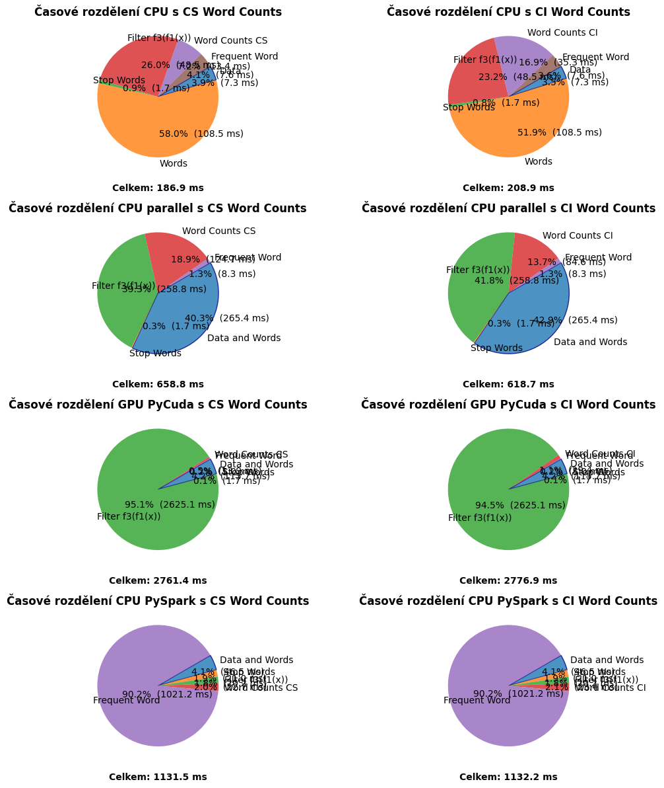
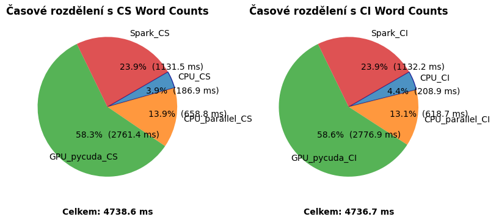

# MPC-PZP
Parallel data processing project in Python

Assigment:

Process enclosed text files.

Tasks:
* Load text file data.txt,
* load text file stop_words.txt
* process data.txt word by word,
* filter words with length greater than 8 and lower than 4,
* filter words according to stop_words.txt file,
* compute statistics - the most frequent word and its occurrences, the less frequent word and its occurrences and the whole number of words after fitrations,
* proposed algorithm should be effective,
* results of time processing of each algorithm (CPU, GPU, ....) draw in to cake chart (use Matplotlib library),
* all demanding outputs print to console.
Create 4 versions of the algorithm:
1. CPU – one threaded algorithm
2. CPU – multithreaded algorithm
    * Parallelize data processing in data.txt
    * Use all available CPU cores
3. GPU version
    * Because the GPU could not easily work with string data type, GPU algorithm would differ. Words from text files need to be mapped to numerical values. Create a dictionary that will contain words and choosen ids. Then convert text files to integer vectors which are able to be processed on GPU.
    * Filtering according to word length will not be performed on GPU (quite hard), but the operation will be done using CPU before GPU processing.
    * Filtering according to stop words will be performed on GPU.
4. Apache spark version
    * Use all available CPU cores.
  

